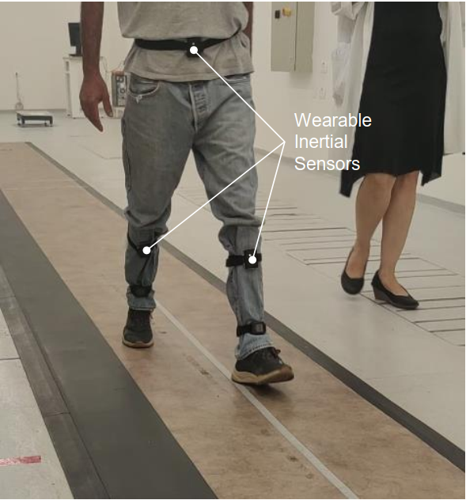

# Step Width Estimation

*Step Width Estimation in Individuals with and without Neurodegenerative Disease via a Novel Data-Augmentation Deep Learning Model and Minimal Wearable Inertial Sensors*

## Summary
This repository includes the code and models for step width estimation in both individuals with and without neurodegenerative disease using three IMUs.

## Software Requirements

- Python 3.8
- PyTorch 2.1.0
- CUDA 12.1
- NumPy 1.22.4
- h5py 3.6.0
- scikit-learn 1.3.1

## IMU Locations

Individuals with ataxia and healthy individuals wore three inertial measurement units (IMUs), which contain 3-dimensional accelerometers and 3-dimensional gyroscopes. The IMUs were positioned at the midpoint between the bilateral femoral medial epicondyle and the tibia apex of the medial malleolus, as well as at the midpoint of the left and right anterior superior iliac spines. Participants performed various walking trials.

## Code

`main_tandata.py` and `main_ataxia.py` are the main scripts for step width estimation for the two groups.

Trained models are located in the `trained_models` folder:
1. Healthy subjects' model
2. Individuals with ataxia's model

